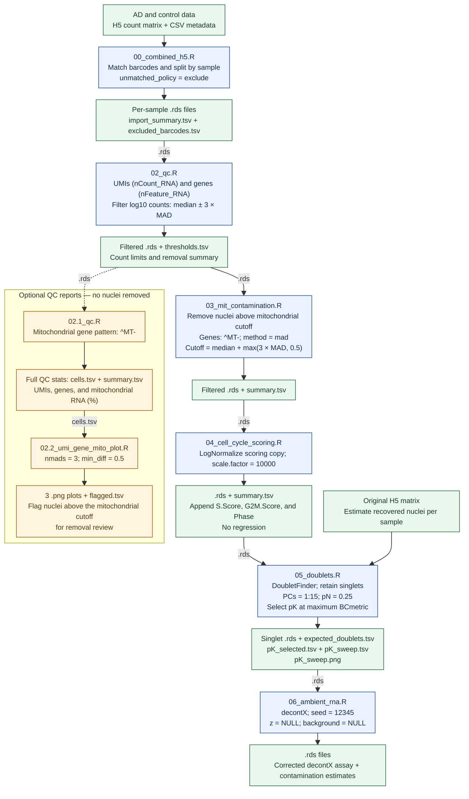

# snRNA-seq pipeline

This DAG shows the pipeline for the Alzheimer disease (AD) and control (Morabito et al., 2021 - [Nature Genetics](https://www.nature.com/articles/s41588-021-00894-z). Article can be found [here](literature/morabito_et_al_2021.pdf) and raw data [here](https://www.ncbi.nlm.nih.gov/geo/query/acc.cgi?acc=GSE174367)).

1 `.rds` = 1 sample

